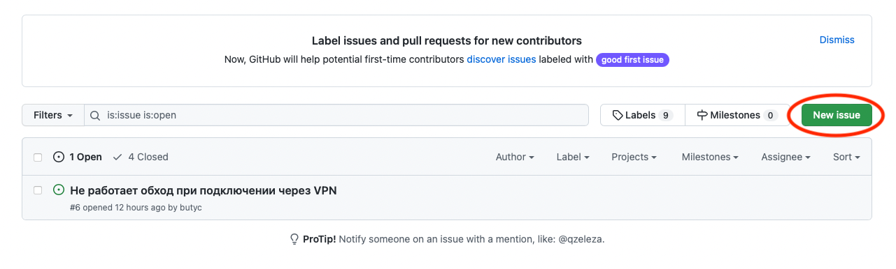
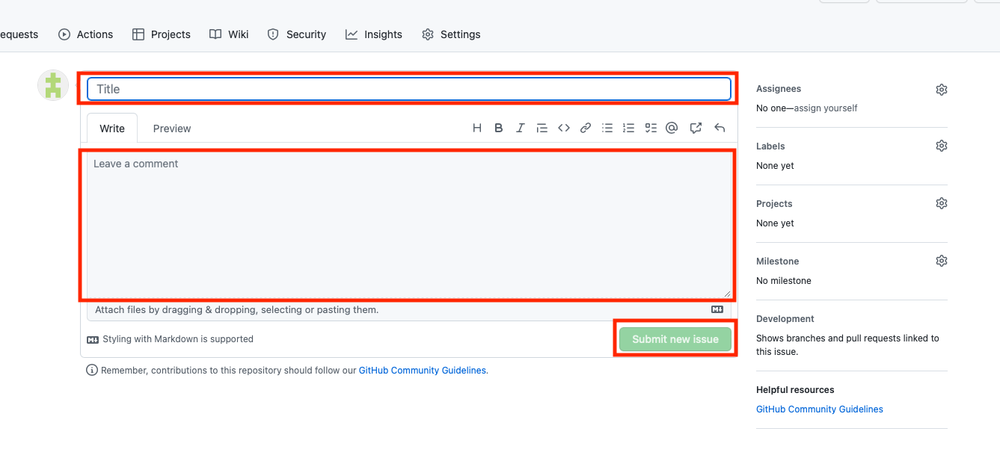

# [КВАС](https://forum.keenetic.com/topic/14415-пробуем-квас-shadowsocks-и-другие-vpn-клиенты/?do=findComment&comment=152234): Правила создания отчета об ошибке

---
_Что необходимо делать при создании отчета об ошибке (далее **тикет** или 
**issue**) с целью фиксации каких либо проблем обнаруженных в ходе использования или установки любого ПО, следует придерживаться следующих правил:_

---

1. **Тема тикета** - содержит краткое, по существу, описание проблемы в одно 
   предложение. 

2. **Тело или содержание тикета** содержит в себе, как минимум два абзаца или раздела:
   
   1. Конкретная версия пакета, в котором обнаружена проблема
   2. **Подробное описание шагов**, которые приводят к ошибке или путь до 
      ошибки;
   3. **Любые поясняющие приложения**, на основании которых можно 
      судить о проявлении самой ошибки:
      - Журналы (логи)
      - Снимки экрана (скриншоты)
      - Словесное описание того, что отображается

---
После того, как Вы составили, все пункты выше, необходимо их зафиксировать 
на странице [Issues](https://github.com/qzeleza/kvas/issues) в [GitHub]
(https://github.com/qzeleza/kvas), создав новый **тикет**, в терминах GitHub 
необходимо нажать на кнопку "New issue".
	 
Затем необходимо в поле "**Title**" внести **тему тикета**, а в поле "**Write**" 
**сождержание тикета**.

После чего необходимо нажать на кнопку "**Submit new issue**" для подтверждения 
создания "тикета".

---
